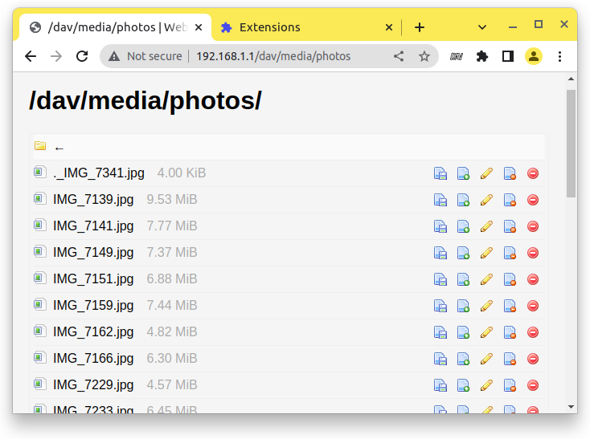

# WebDAV browser extension
Chrome and Firefox extension to browse a URL as a WebDAV share.

Open WebDAV folder in a browser and you'll have ether 403 error or just a plain directory listing.
Then click on the addon button and it will make a file manager from the folder where you can watch, upload, delete files and direcotries.

See [usage video](usage.gif) 

It just uses the https://github.com/dom111/webdav-js
But instead of a bookmarklet you can use it as an extension.

## Install
* [Firefox](https://addons.mozilla.org/en-US/firefox/addon/webdav-browser/)
* Chrome: TBD (I don't have a dev account)
* [Edge](https://microsoftedge.microsoft.com/addons/detail/webdav-browser/eombekfdnaaaakejkpdncleghmfmmjfo)
* Mobile Firefox via UserScript in TamperMonkey https://gist.github.com/stokito/a7babfa3c04c92c6c4142581145fe33d

## See also
* [WebDAV User Script for Tampermonkey, Greasemonkey and Violentmonkey](https://gist.github.com/stokito/a7babfa3c04c92c6c4142581145fe33d) it can be used on Firefox Mobile
* [Awesome WebDAV](https://github.com/stokito/awesome-webdav) list of useful software and services for WebDAV

## Automatic detection of WebDAV
The plugin tries to determine a webdav share itself with following heuristics:
- Response to GET contains `DAV` header
- Response to GET with 403 or 405 status e.g. a typical response when a directory listing disabled
- subdomain `dav` or `webdav` e.g. `https://dav.example.com/`
- path has directory `/dav/` or `/webdav/` e.g. `https://example.com/dav/`

This covers most cases IRL.

## TODO and known problems
* You need a dir listing enabled otherwise it will fail due to a bug https://github.com/dom111/webdav-js/issues/123
* NextCloud restricts a content script injection, but you anyway don't need the plugin.
* [x] Remember folders that should be viewed as dav
* Use a state as for Dark Reader or tutorial.focus-mode. The current popup solution is lame.
* Autodetect a webdav share (partially solved):
  * [x] On 403 error we can try a PROPFIND or OPTIONS. If it was successful then load the UI.
  * [x] `DAV: 1,2,3` header is already in use but returned only on OPTIONS. Maybe add it on `GET /` 403 error? **UPD** It's not used by any server but you may add the header manually.
  * `Alt-Svc: dav` header https://developer.mozilla.org/en-US/docs/Web/HTTP/Headers/Alt-Svc But nobody will set the header. Discussion about possible solutions https://lists.w3.org/Archives/Public/w3c-dist-auth/2023JanMar/0000.html
  * If the directory has a listing with a `<title>Index of ...</title>` then it may have a dav version too but unlikely.
  * [x] By a folder name `/dav/` or subdomain `dav.example.com`
  * List of existing cloud providers like `https://webdav.yandex.ru`. **UPD** Most providers have dav/webdav subdomain
* Option to load the webdav-js directly from CDN with a latest version
* Open any WebDAV server e.g. just as an app. See also https://github.com/dom111/webdav-js/issues/120

## Details
Currently there is no a simple solution to see and work with a WebDAV share for unexperienced users. You need to mount a drive (which is not that easy) or you need to use a special software.
Ideally users should be able to do this just from a browser.
This is possible if install on a server a webdav-js script or use the webdav-js as a bookmarklet from a browser (still complicated for most users).
So we need to add the WebDAV support directly to a browser or at least for now we can create an extension/addon/plugin.

To test it you can open any SVN repository and press on it's icon. For example SVN repo of the EmailRelay
https://svn.code.sf.net/p/emailrelay/code/trunk/

The SVN is based on WebDAV so you can probably even mount an SVN repo into folder.

The main goal of the plugin is to make an autodetection of WebDAV share. So when you opening a WebDAV share from a browser the `GET /` will result into 403 Forbidden error.
This is confusing but it's how spec is written.
My plugin can catch 403 error and try to make a WebDAV PROPFIND call for a directory listing. If it was successful then we can load the WebDAV UI. Yesterday I made some prototype.

But if the webdav share has a plain HTML directory listing enabled (e.g. 99% cases) then instead of 403 error it will generate an html list and return with 200 OK status. In this case the plugin can't figure out that the folder is a webdav share.
A good news that in a spec there is a dedicated DAV header that shows that the url has a webdav share. But the problem is that the header is returned only on OPTIONS call.
So again this can't be used out of the box. But we may configure a server to always add the header (bad idea beacause it may have many options).

Currently the plugin just calls a webdav-js library that makes rendering of UI. But the library is always assumes that a directory listing is enabled and fails if it's not. I reported a bug https://github.com/dom111/webdav-js/issues/123 but it won't be fixed soon for sure.

Also I wanted to add a dav:// protocol schema handler to the plugin but it's not possible: https://discourse.mozilla.org/t/protocol-handler-extension-for-webdav/111920

If anyone interested to test or contribute to the plugin I'll appreciate

### Manifest problem
When packing for Chrome use manifest.json but for firefox use manifest.firefox.json 
